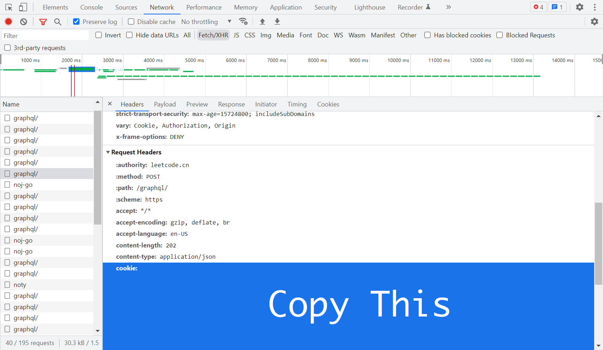

# LeetCode-Dumper
[中文](https://github.com/wpn-zju/LeetCode-Dumper/blob/main/README-CN.md)

A python script to dump all your AC submission

# Pre-requisites
1. Install [chevron](https://github.com/noahmorrison/chevron), a python implementation of the mustache templating language. `pip3 install chevron`.

# Features
1. Support both [LeetCode](https://leetcode.com) and [LeetCode China](https://leetcode.cn).
1. Utilize multithreading so that we can download 1k+ submissions in couple minutes.
1. Problem IDs to be dumped is configurable.

# Usage
1. You must get the cookie you sent to LeetCode in the request header before dumping your codes using this tool.
1. Open any pages of LeetCode, open `DevTools`, find `Network`, filter `Fetch/XHR`, find any GraphQL requests, open the request, find and copy the cookie in the request header part.
1. `python grab.py -d intl -c <cookie>`
1. Wait until it's done.



# Todo
1. Add option for dumping all ac attempts
1. Allow option for output path
1. Add more lanugage support
1. Add submission metadata (runtime distribution, memory usage distribution) as comment in the code
1. Add range dumping option, e.g. dumping #100 - #200
1. Add override option for skipped questions
1. Add question description and test cases

# Troubleshooting
## Code Extension Not Found
```
Question #1549 - Code extension not found, please manually add the extension name into the script, lang code [mysql].
```

If you are unable to find your coding language in the file extension mapping and see the warning message above, please add the language-ext mapping in the script.

## Partial Failure
```
Question #1207 - 'NoneType' object is not subscriptable
```

This is because multithreading downloading reaches the threshold TPS of LeetCode, thus some of requests are not returning as expected. You can mitigate the issue by running the script multiple times, or reducing the max-threads by adding command line option `-t=<threads>`.

# Result Example
https://github.com/wpn-zju/LeetCode-Dump

# Thanks
https://github.com/enh6/leetcode/blob/master/grab_solutions.py
